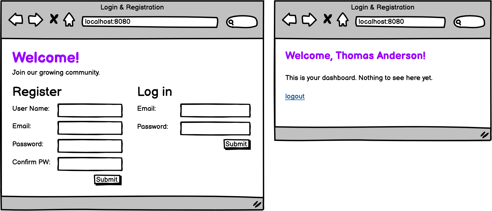

# Assignment: Login and Registration

**Objectives:**

- Build an application that requires both user authentication and validations
- Add server-side validations in addition to model-level validations
- Implement authentication logic
- Use Optionals to check if a user exists
- Import and use BCrypt to create hashes and compare hashed strings against the database.
- Use and manipulate transient member variables and non-entity classes
- Handle user logout and active session status
- Use session data to pull the current user's information

#
In this assignment, you're going to build a Spring application that allows for login and registration.

**Registration**

The user inputs their information, we verify that the information is correct, insert it into the database and return back with a success message. If the information is not valid, redirect to the registration page and show the following requirements:

**Validations and Fields to Include**
1. User Name - letters only, at least 3 characters, not blank
2. Email - valid Email format, does not already exist in the database, not blank
3. Password - at least 8 characters, not blank
4. Password Confirmation - matches password

**Login**

When the user initially registers, we would log them in automatically, but for logging in, we need to validate in a different way:

1. Check whether the email provided is associated with a user in the database
2. If it is, check whether the password matches what's saved in the database
**But how do we keep track of them once they've logged in?** I think you might already know...session! We can create a session variable that holds the user's id. From our study in database design, we know that if we have the id of any table, we can gather the rest of the information that is associated with that id. Storing a single session variable with the user's id is all we need to access all the information associated with that user.

**Logout**

On the success page, have a logout button or link. When a user logs out, their session should be cleared. If the user attempts to access the success page (i.e., making a GET request by typing in the url), redirect them back to the login and registration page.

