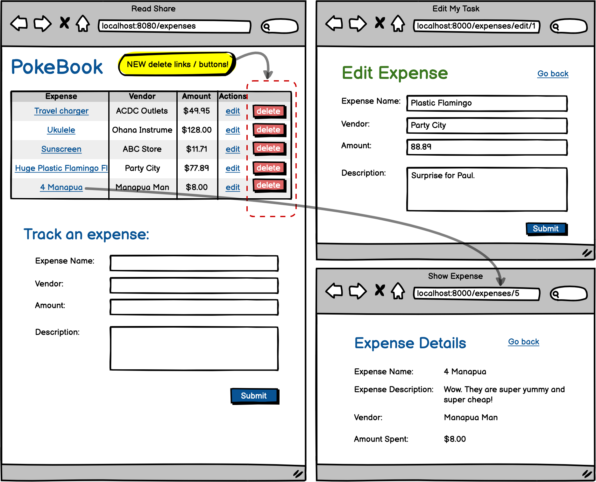

# Add to PokeBook

So a friend of yours is going to Hawaii and is worried about their budget for the trip. To save them some time and worry, you've decided to build an app that they can use any time to help save and plan for special occasions. 

### Objectives:

Collect input from the user to add new records in the database.
Become familiar with data binding and how to implement it in SpringMVC.
Identify, use correctly and understand the @ModelAttribute annotation.
Use form:form tags to be able to use data binding.
Implement validations for user input.

### Assignment

For this assignment, you will be creating an app to track a user's expenses, a digital pocket book. You'll need to create a new project that will store the details for every expense and allow users to add new expenses from a form.

- [x] Create a new Spring Project with packages for models, repositories, services and controllers.

- [x] Create a model called Expense with all the appropriate fields. Don't forget to add annotations and getters & setters!

- [x] Add all the appropriate dependencies and set up for adding JSP views and connecting to the database

- [x] Create a schema for the project and test the set up by running your project. Debug as necessary!

- [x] Create an index.jsp file with a table and a form (hard coded for now).

- [x] Create a route in your controller to render index.jsp and just test that it renders.

- [x] Set up your ExpenseRepository (findAll is the only necessary query method to add at this time)

- [x] Set up your ExpenseService with any necessary methods. Don't forget to inject your repository interface as a dependency.

- [x] Add @ModelAttribute annotation and associated syntax to your render route, to bind an empty Expense object to the JSP form to capture the user input.

- [x] In your JSP, change the form tags to form:form tags, add the modelAttribute, error tags and be sure to include the path attribute.

- [x] Add a POST route in your controller to process the form and add a new expense to the database, using the @ModelAttribute annotation to receive the filled Expense object.

- [x] Be sure the POST route redirects to the render route after creating the new expense.

- [x] Test successful creation by adding some new (valid) entries in the form. For now, use workbench to see the results in the database.

- [x] In your render route, retrieve all the records from the database and render them on the page and test.

- [x] Finally be sure to handle validations in your POST method. If the user has any errors, you'll need to render the page again.. but remember you may need to send in some data here as well!