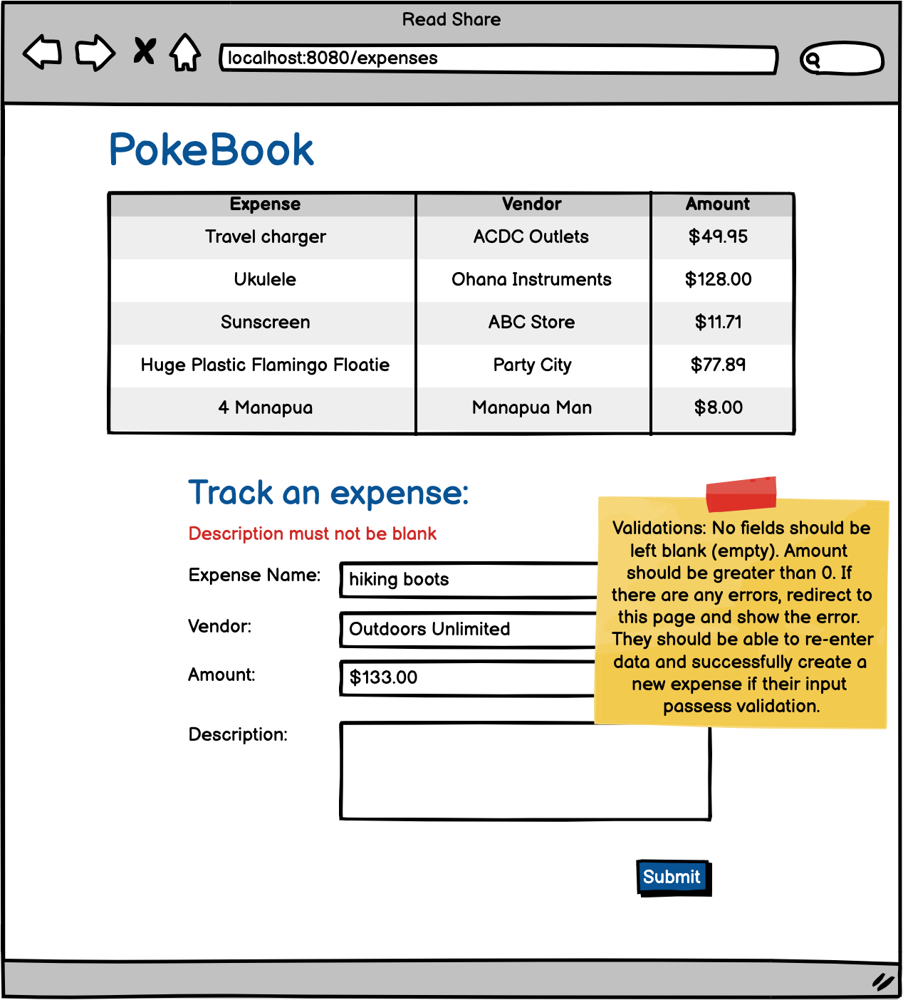
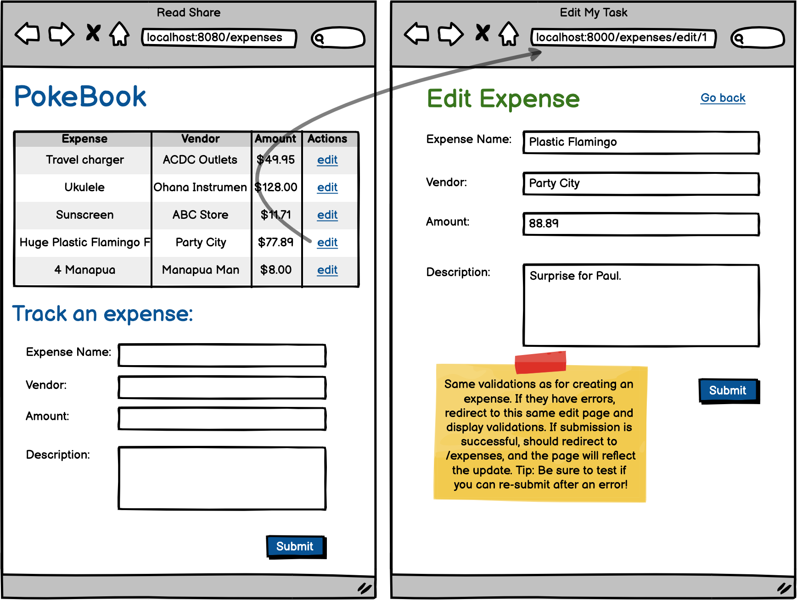

# Add to PokeBook

So a friend of yours is going to Hawaii and is worried about their budget for the trip. To save them some time and worry, you've decided to build an app that they can use any time to help save and plan for special occasions. 

### Objectives:

Collect input from the user to add new records in the database.
Become familiar with data binding and how to implement it in SpringMVC.
Identify, use correctly and understand the @ModelAttribute annotation.
Use form:form tags to be able to use data binding.
Implement validations for user input.

### Assignment

For this assignment, you will be creating an app to track a user's expenses, a digital pocket book. You'll need to create a new project that will store the details for every expense and allow users to add new expenses from a form.

- [x] Create a new Spring Project with packages for models, repositories, services and controllers.

- [x] Create a model called Expense with all the appropriate fields. Don't forget to add annotations and getters & setters!

- [x] Add all the appropriate dependencies and set up for adding JSP views and connecting to the database

- [x] Create a schema for the project and test the set up by running your project. Debug as necessary!

- [x] Create an index.jsp file with a table and a form (hard coded for now).

- [x] Create a route in your controller to render index.jsp and just test that it renders.

- [x] Set up your ExpenseRepository (findAll is the only necessary query method to add at this time)

- [x] Set up your ExpenseService with any necessary methods. Don't forget to inject your repository interface as a dependency.

- [x] Add @ModelAttribute annotation and associated syntax to your render route, to bind an empty Expense object to the JSP form to capture the user input.

- [x] In your JSP, change the form tags to form:form tags, add the modelAttribute, error tags and be sure to include the path attribute.

- [x] Add a POST route in your controller to process the form and add a new expense to the database, using the @ModelAttribute annotation to receive the filled Expense object.

- [x] Be sure the POST route redirects to the render route after creating the new expense.

- [x] Test successful creation by adding some new (valid) entries in the form. For now, use workbench to see the results in the database.

- [x] In your render route, retrieve all the records from the database and render them on the page and test.

- [x] Finally be sure to handle validations in your POST method. If the user has any errors, you'll need to render the page again.. but remember you may need to send in some data here as well!

# Edit PokeBook

The next step is to add in the ability to update their expenses.

### Objectives:

- More practice with data binding and familiarity with using form:forms with an existing instance.
- Encounter common issues when implementing update in a full-stack application.
- More practice organizing render routes and POST routes.
- Bonus: Practice RESTful routing by implementing a PUT route
- Note: using POST in this assignment for processing an update is also okay

- [x] Make a task list for how to approach adding update functionality to this project.

- [] Work with at least one other student at some point while completing this assignment.

- [x] Keep a list of challenging aspects and specific bugs you fixed for future reference and to help others.

- [x] Implement all the features detailed in the above wireframe into your PokeBook project.

# Full CRUD PokeBook

And finally, the last step to make our little pocket book app fully ready to track our expenses is to add delete functionality for our users. When you finish this assignment, not only will your hypothetical friend be super appreciative they get to climb up to the top of a volcano with out worrying about their expenses, but you will have finished a monster project. As you wrap up this assignment, take some time to celebrate completing your first full-CRUD, full-stack assignment!

### Objectives:

- Implement delete functionality.
- Show details for a particular expense.
- Complete a Full-Stack, Full-CRUD application!

***Note:*** While it is a good idea to practice using RESTful routing by adding delete mapping, the aim of this assignment is for you to understand how to implement a delete feature, so if you find yourself stuck and need to use a POST or GET mapping for your delete, that's fine.

- [x] Add delete buttons to the index.jsp

- [x] Make a new route that will process a delete and redirect to the "/expenses". The record should disappear from the table.

- [x] Add a new JSP to show details for a single expense.

- [x] Add a route to render the single expense details "/expenses/2"

- [x] On your index page, change the expense names into anchor tags, that map to the details page for that particular expense.
