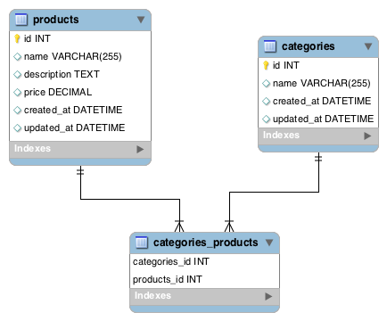
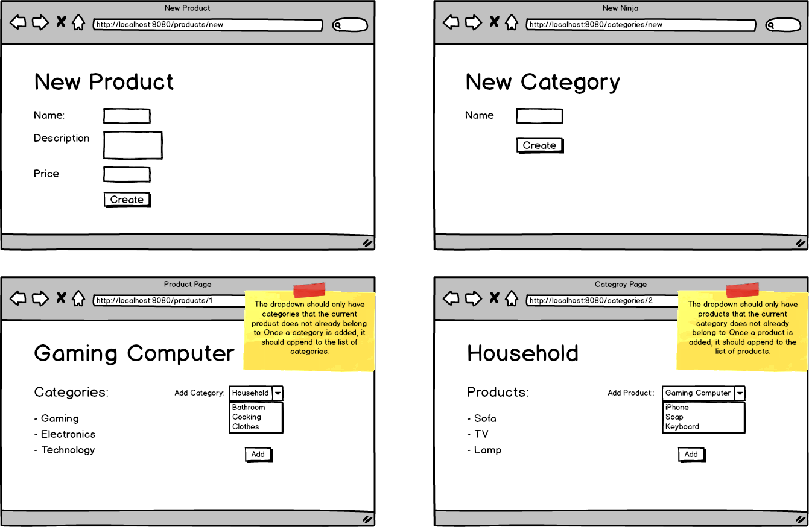

# Products and Categories

In this assignment, you will be creating an application that will keep track of products and categories

**Objectives:**

Implement a typical many-to-many relationship
Become more familiar with JPA methods as applied to n:m relationships.







**CategoryRepository**

Some derived queries you may need to get you started..
```
    // Retrieves a list of all categories for a particular product
    List<Category> findAllByProducts(Product product);
    
    // Retrieves a list of any categories a particular product
    // does not belong to.
    List<Category> findByProductsNotContains(Product product);
```

**Note: No Middle Model Needed**

For this assignment you need only implement two models: ```Product``` and ```Category```. Since there is no extra data required for the relationship, you do not need a middle model, that is, you do not need a class to handle the joiner table in the database.


- [x] Allow users to create a product.


- [x] Allow users to create a new category.


- [x] In the products show page, allow users to add a category to a specific product.


- [x] In the categories show page, allow users to add a product to a specific category