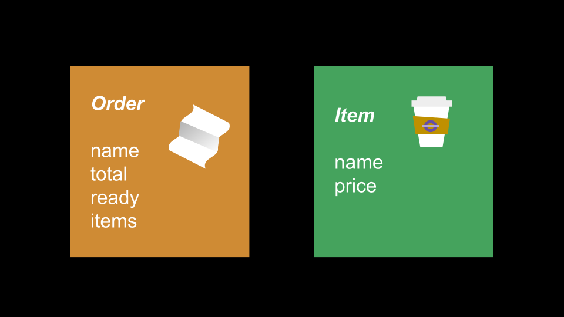

# Orders & Items

**Objectives:**

- Use another class file to help store data related to the app in a more organized way.
- Understand the value of grouping data together in a class to perform similar operations.
- Set member variables inside a class file
- Be able to instantiate a new instance of a class (initialize a custom data type).



Let's make a new and improved Cafe app! Separate from your prior Cafe projects, create a new folder for this assignment. Next, create 2 new class files for an ```Order``` and an ```Item``` class. They should have the following member variables:

### Item class member variables:

- String name
- double price

### Order class member variables:
- String name
- double total
- boolean ready
- ArrayList<Item> items
Of course, you will also need to demo its capabilities for the dev team, so make another testing file ```TestOrders``` class, with a  ```main```  method to do this. Tip! When creating new instances don't forget the ```new``` keyword for instantiating objects!

```
import java.util.ArrayList;
public class TestOrders {
    public static void main(String[] args) {
    
        // Menu items
    
        // Order variables -- order1, order2 etc.
    
        // Application Simulations
        // Use this example code to test various orders' updates
        System.out.printf("Name: %s\n", order1.name);
        System.out.printf("Total: %s\n", order1.total);
        System.out.printf("Ready: %s\n", order1.ready);
    }
}
```

- [x] Create the Item class with the member variables listed above.


- [x] Create the Order class with the member variables listed above.


- [x] Create the testing file TestOrders and complete the rest of the tasks inside the testing file.


- [x] Create 4 item variables of type Item and instantiate each as an Item object. Name them item1, item2 etc.


- [x] Set the price and the name for each -- "mocha", "latte", "drip coffee" and "capuccino" (price is up to you!)


- [x] Create 4 order variables of type Order and instantiate each as an Order object. Name them order1, order2 etc.


- [x] Set each order's name -- "Cindhuri", "Jimmy", "Noah", "Sam".


- [x] Print the order1 variable to the console to see what happens.


- [x] Predict what will happen if you print order1.total


- [x] Add item1 to order2's item list and increment the order's total.


- [x] order3 ordered a cappucino. Add the cappuccino to their order list and to their tab.


- [x] order4 added a latte. Update accordingly.


- [x] Cindhuri’s order is now ready. Update her status.


- [x] Sam ordered more drinks - 2 lattes. Update their order as well.


- [x] Jimmy’s order is now ready. Update his status.