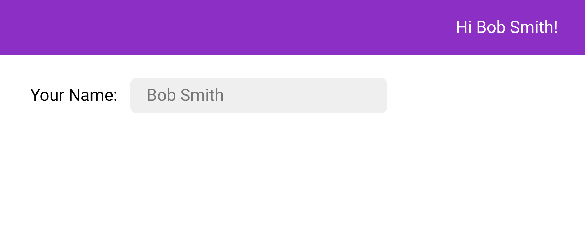

# Navbar Context (Optional)

Create a React project that has a navbar with a message that says the user's name ("Hi, *some_name_here*!"). In the body of the page, have an input where the user can dynamically change the name in the navbar. You will need to create the following components:

- Form.js: This component should actually hold the input field.
- FormWrapper.js: This component should only wrap the Form Component as its child. This is to illustrate that you can use nested components with context without passing down props.
- Navbar.js: This component should be your navbar which contains the greeting.
- Wrapper.js: This component should wrap the Navbar and the FormWrapper components (and will access useState).
You will also need to create the context object.

Your App.js function should look something like this (note that Navbar and FormWrapper don't take in any props): 



<br>

```m
function App() {
    return (
        <Wrapper>
            <Navbar/>
            <FormWrapper/>
        </Wrapper>
    );
}
```


- [x] Create the Form Component

- [x] Create the FormWrapper Component

- [x] Create your Navbar Component

- [x] Create the Wrapper Component

- [x] Create the context object

#

To use the code
- create a new react app called ``navbar `` 

```
npx create-react-app navbar
```

and then replace the ``src`` folder with [this folder](https://github.com/SaraSaeed1/Software-Web-Development-Bootcamp/tree/main/MERN_stack/React/Navbar/src)

