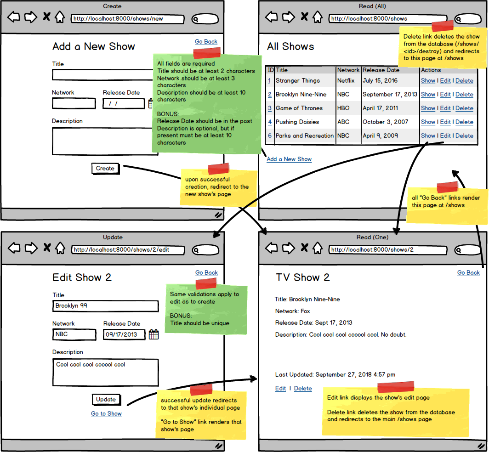

### Assignment: Semi-Restful TV Shows Validated

**Objectives:**

- Practice validating data before entering it into the database
#

Let's add validations to your existing Semi-Restful TV Shows assignment! Building off of your existing assignment, implement the validations indicated on the green sticky notes to prevent dirty data from getting into your database. If a submission is invalid, display errors on the appropriate page.

- [x] Validate the Add a TV Show form to ensure all fields are populated appropriately before adding to the database.

- [x] Display errors on the Add a TV Show form if the information is invalid.

- [x] Validate the Edit Show form with the same validations as creation.

- [x] Display errors on the Edit Show form if the information is invalid.

- [x] NINJA BONUS: Ensure the Release Date is in the past.

- [x] NINJA BONUS: Allow the description to be optional. If a description is provided, though, it should still be at least 10 characters.

- [x] SENSEI BONUS: Validate that a TV show with that title does not already exist in the database before creating or updating.

- [ ] SENSEI BONUS: Do uniqueness validations (including displaying errors) for creating and updating using AJAX!