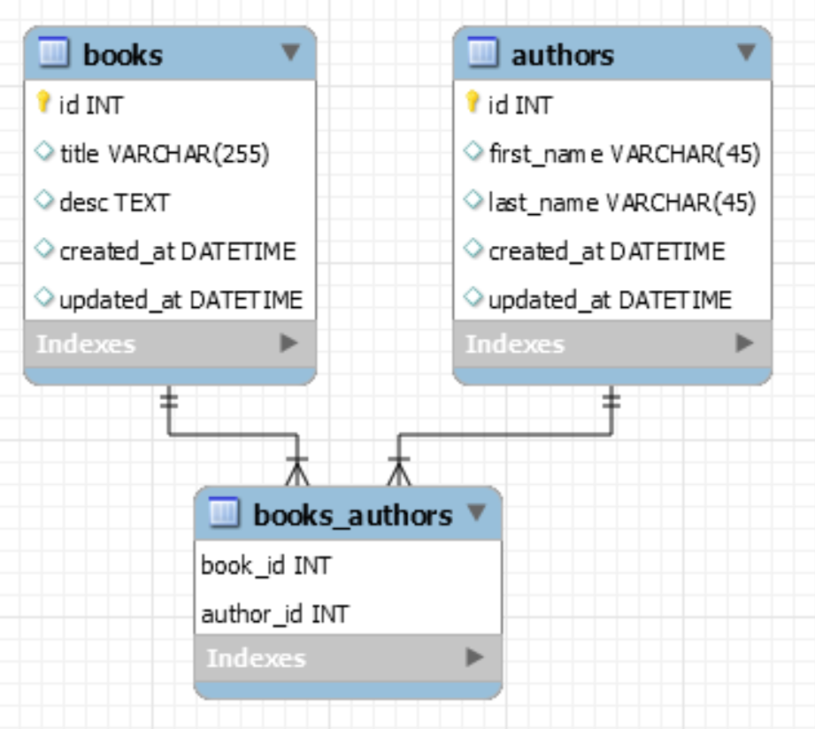

### Assignment: Books/Authors (Shell)

**Objectives:**

- Practice using the Django Shell to run ORM commands to manipulate our database
- Practice many-to-many relationships
#

Create a new project called books_authors_proj and an app called books_authors_app. Use the following diagram as a guide for designing your models:

 

- [x] Create the Book class model

- [x] Create the Author class model

- [x] Create and run the migration files to create the tables in your database

- [x] Create a .txt file where you'll save each of your queries from below

- [x] Query: Create 5 books with the following names: C Sharp, Java, Python, PHP, Ruby

- [x] Query: Create 5 different authors: Jane Austen, Emily Dickinson, Fyodor Dostoevsky, William Shakespeare, Lau Tzu

- [x] Add a new text field in the authors table called 'notes'.

- [x] Create and run the migration files to update the table in your database.

- [x] Query: Change the name of the C Sharp book to C#

- [x] Query: Change the first name of the 4th author to Bill

- [x] Query: Assign the first author to the first 2 books

- [x] Query: Assign the second author to the first 3 books

- [x] Query: Assign the third author to the first 4 books

- [x] Query: Assign the fourth author to the first 5 books (or in other words, all the books)

- [x] Query: Retrieve all the authors for the 3rd book

- [x] Query: Remove the first author of the 3rd book

- [x] Query: Add the 5th author as one of the authors of the 2nd book

- [x] Query: Find all the books that the 3rd author is part of

- [x] Query: Find all the authors that contributed to the 5th book

- [x] Submit your .txt file that contains all the queries you ran in the shell