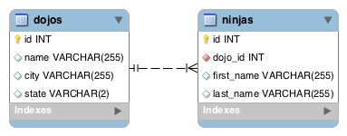

### Assignment: Dojo & Ninjas (Shell)

**Objectives:**

- Practice using the Django Shell to run ORM commands to manipulate our database
- Practice one-to-many relationships
Create a new project called dojo_ninjas_proj and an app called dojo_ninjas_app. For this project, use the following diagram as a guide for creating your models:
 

- [x] Create the Dojo class model

- [x] Create the Ninja class model

- [x] Create and run the migration files to create the tables in your database

- [x] Create a .txt file where you'll save each of your queries from below

- [x] Run the shell and import your models

- [x] Query: Create 3 new dojos

- [x] Query: Delete the 3 dojos you just created

- [x] Query: Create 3 more dojos

- [x] Query: Create 3 ninjas that belong to the first dojo

- [x] Query: Create 3 ninjas that belong to the second dojo

- [x] Query: Create 3 ninjas that belong to the third dojo

- [x] Query: Retrieve all the ninjas from the first dojo

- [x] Query: Retrieve all the ninjas from the last dojo

- [x] Query: Retrieve the last ninja's dojo

- [x] Add a new text field called "desc" to your Dojo class

- [x] Create and run the migration files to update the table in your database. If needed, provide a default value of "old dojo"

- [x] Query: Create a new dojo

- [x] Submit your .txt file that contains all the queries you ran in the shell