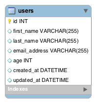

### Assignment: Users (Shell)

**Objectives:**

Practice using the Django Shell to run ORM commands to manipulate our database
Create a new project called single_model_orm with an app called users_app. Using the following ERD, complete the tasks listed below:
#

- [x] Create a model called User following the ERD above

- [x] Create and run the migration files to create the User table in your database

- [x] Create a .txt file where you'll save each of the queries you'll run in the shell

- [x] Run the shell and import your User model

- [x] Query: Create 3 new users

- [x] Query: Retrieve all the users

- [x] Query: Retrieve the last user

- [x] Query: Retrieve the first user

- [x] Query: Change the user with id=3 so their last name is Pancakes.

- [x] Query: Delete the user with id=2 from the database

- [x] Query: Get all the users, sorted by their first name

- [x] BONUS Query: Get all the users, sorted by their first name in descending order

- [x] Submit your .txt file that contains all the queries you ran in the shell